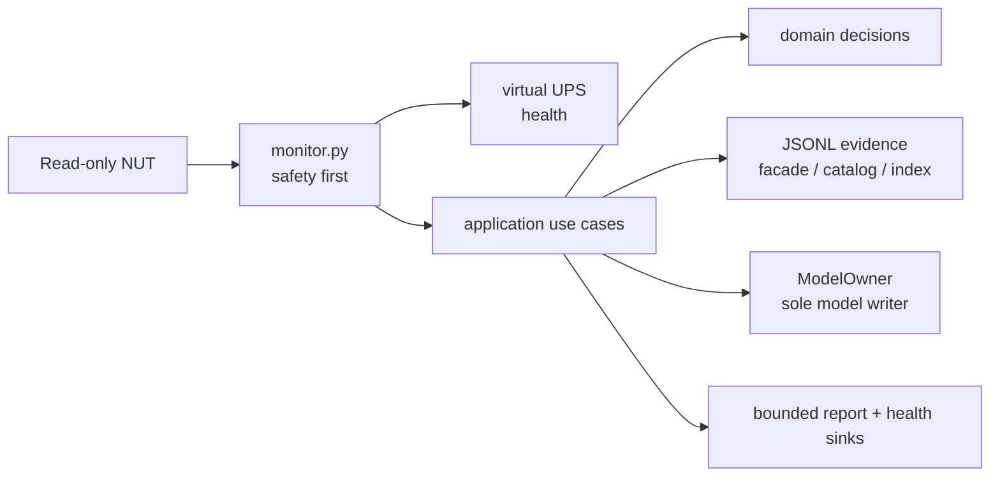

# Automatic Blackout Learning Operations Runbook

**Status:** Candidate acceptance and rollback procedure. This document does not claim deployment.

This runbook covers the per-event JSONL candidate described by ADR 0003 and the Slice-0 authority
boundary in ADR 0004. Run it only against a pinned release candidate that has passed its automated
and review gates. Safety has priority over data collection or learning.

Normative companions: [ADR 0003](adr/0003-domain-jsonl-automatic-blackout-learning.md),
[ADR 0004](adr/0004-unified-fragment-capabilities-and-recharge-linkage.md),
[Glossary](GLOSSARY.md), and [user scenarios](USER-SCENARIOS.md).

The release gates are fixed: per-function CRAP must be at most 30, every production module at most
800 physical source lines and every class at most 500, and the Ruff, `lint-imports`, `tach check`,
`tach check --exact`, type, dead-code, formatting, and test checks must pass. Run `just check` at
the release-candidate boundary. A green gate is not live UPS validation and does not imply
deployment.

## Current architecture map

This is the normative map for the candidate used by this runbook. Historical plans and review
receipts under `docs/plans/` and `docs/reviews/` remain preserved evidence; do not use their
intermediate module counts or dependency maps as deployment instructions.



Text fallback: `NUT -> monitor safety -> virtual UPS`; only after publication does the monitor
queue application work. Application code calls domain decisions, JSONL evidence, the sole model
writer, and bounded sinks. The runtime has no UPS command path. This diagram describes code only;
it is not deployment or live-UAT evidence.

## State and evidence paths

| Purpose | Path |
|---|---|
| Active model | `~/.config/ups-battery-monitor/model.json` |
| Per-event evidence and bounded registry/index | `~/.config/ups-battery-monitor/events/` |
| Event-store writer lock | `~/.config/ups-battery-monitor/monitor.lock` |
| Runtime health | `/run/ups-battery-monitor/ups-health.json` |
| Virtual UPS publication | `/run/ups-battery-monitor/ups-virtual.dev` |
| NUT production configuration | `/etc/nut/ups.conf`, `/etc/nut/upsmon.conf` |
| Release A historical archive | `~/.config/ups-battery-monitor/discharge-events-v1.jsonl` |

The event JSONL files are scientific evidence. Journald is the human/event log. Do not edit,
merge, truncate, or reverse-import either evidence format. Do not create a SQLite copy for runtime
use. Preserve event files and the Release A journal during rollback.

## Read-only preflight

Run these checks while the service is running and the UPS is physically online. They do not send a
UPS command:

```bash
upsc cyberpower@localhost ups.status
upsc cyberpower-virtual@localhost ups.status
upsc cyberpower@localhost battery.charge
upsc cyberpower-virtual@localhost battery.runtime
systemctl is-active ups-battery-monitor.service
jq -e '
  .schema_version == 2 and
  .capture_queue.capture_available == true and
  .capture_queue.observations_queued == 0 and
  .capture_queue.observation_overflow_count == 0 and
  .capture_queue.lifecycle_overflow_count == 0 and
  .storage.capture_available == true and
  .storage.alarm == null and
  .storage.rebuild_stalled == false
' /run/ups-battery-monitor/ups-health.json
python3 -m src.motd_status
sha256sum ~/.config/ups-battery-monitor/model.json
cat /proc/sys/kernel/random/boot_id
if test -d ~/.config/ups-battery-monitor/events; then
  find ~/.config/ups-battery-monitor/events -maxdepth 1 -type f \
    -printf '%f %s bytes\n' | sort
else
  printf '%s\n' 'events directory is absent before candidate cutover'
fi
journalctl -u ups-battery-monitor.service --since today --no-pager
```

Record the command output with the candidate artifact identity and current model scientific
fingerprint. Check all of the following before stopping anything:

- Physical and virtual status are `OL`; neither contains `LB` or `FSD`.
- Virtual publication is no older than the derived default 30 seconds
  (`publication_max_age_s = 30.0`), and NUT fields pass normal validation.
- Reported charge is at least 90% and modeled reserve is at least 18 minutes at current load.
- Load is inside the UPS and acceptance-test safe range.
- No shutdown is pending and the physical control path remains available.
- The daemon is the sole writer. Capture/storage health is green, the observation queue is empty,
  and no rebuild is stalled.
- Record the event inventory, boot ID, model hash/fingerprint, and service-log excerpt. The daemon is
  read-only with respect to NUT: this runbook does not provide or invent a UPS test/power command.
- Verify the pinned Release A binary/config and pre-transform model backup offline.
- On a copy, calculate and register the exact source and expected target fingerprints.
- The complete candidate has passed automated and Cross-AI release gates.

Abort preflight on any missing, stale, contradictory, or unexplained value. Do not repair JSONL or
`model.json` by hand.

### V3 capability-baseline preflight (Slice 0)

The read-only producer exists, but this section is not evidence that v3 is implemented or
deployed. The baseline is derived configuration at
`~/.config/ups-battery-monitor/telemetry-capability-baseline-v1.json`; it is not scientific
evidence.

Before v3 activation, while the physical UPS is online and the normal control path is available:

1. Confirm that no test or power command is in progress. The baseline producer is read-only with
   respect to NUT and must not start, stop, or schedule a UPS test.
2. Confirm `~/.config/ups-battery-monitor` is owned by the service user with mode `0700`, then run
   the reviewed producer from the pinned checkout. It reads only ordinary `LIST VAR` replies and
   refuses to replace an existing artifact:

   ```bash
   scripts/record-telemetry-capability-baseline \
     --output ~/.config/ups-battery-monitor/telemetry-capability-baseline-v1.json
   ```

   The canonical filename is intentional; dated sibling baselines are not runtime authority. A
   persistent owner-only dot-lock coordinates future runs. An interrupted publication may leave
   an owner-only `.tmp-*` dotfile, which is not a baseline and must never be selected manually.
3. Require exactly 60 consecutive complete ordinary replies, plus UPS model/serial, explicit UPS
   firmware presence/value when exposed, and NUT driver identity/version. Absence of an UPS
   firmware field is recorded as absence; a driver version is never substituted for it. The
   production window takes about one minute at the fixed one-second cadence. The producer must
   align later poll starts to monotonic one-second deadlines from collection start; an overrun
   starts the next overdue poll immediately without negative sleep or accumulated drift. It must
   refuse concurrent runs, incomplete replies,
   identity changes, unsafe ownership/mode, and implicit replacement of an existing destination.
4. Verify canonical schema, owner-only permissions, configured endpoint, and current physical
   identity through one additional ordinary `LIST VAR` reply:

   ```bash
   scripts/record-telemetry-capability-baseline --verify \
     --output ~/.config/ups-battery-monitor/telemetry-capability-baseline-v1.json
   ```

   `--verify` checks only the canonical artifact/schema, owner-only permissions, configured
   endpoint, and current physical NUT identity. It does not compare state-scoped token-shape
   signatures; those signatures are admission evidence for the v3 preflight and exact-state
   capability admission.

   Confirm that the artifact records every observed `ups.status`. Optional fields are scoped only
   to states in which they were observed; an OL-only run cannot authorize a battery-on-OB
   capability.
5. Require the v3 activation preflight to match the baseline's physical UPS and NUT identity. A
   missing, corrupt, non-owner-only, or mismatched baseline is a fail-closed activation refusal:
   stop, keep the prior runtime untouched, and follow the stale-baseline recovery procedure below.
   Never seed the initial v3 manifest from a fixture, an archive, or silent daemon auto-collection.

#### Safe stale-baseline recovery

The canonical artifact is derived configuration, not scientific evidence. A stale, corrupt,
non-owner-only, or identity-mismatched artifact must never be used as a compatibility input. Keep v3
activation blocked and leave the existing safety/runtime service untouched while recovering it.
The checks below are entered from fish, but the multiline recovery transactions are explicitly run
inside `bash -c`; the Python heredocs are not fish syntax. The workflow uses no broad recursive
deletion and never follows the final artifact symlink.

1. Confirm that the physical UPS is online and that no test or power command is in progress. Ensure
   that no baseline record or verify process remains active; the command must print no rows. If it
   prints a process, wait for it to finish and do not kill it by a broad pattern:

   ```fish
   pgrep -af '[r]ecord-telemetry-capability-baseline|[t]elemetry_capability_cli' || true
   ```

2. Validate the exact parent, canonical artifact, and persistent baseline lock before moving
   anything. Run as the service user, and retain the printed owner UID, mode, size, and SHA-256 as
   the recovery receipt. A failure is a stop condition; do not substitute a similarly named file.
   From fish, invoke the following audited transaction through `bash -c`:

   ```bash
   bash -c '
   set -euo pipefail
   python3 - "$HOME/.config/ups-battery-monitor/telemetry-capability-baseline-v1.json" <<PY
   import errno
   import fcntl
   import hashlib
   import os
   import stat
   import sys

   path = os.path.abspath(sys.argv[1])
   parent = os.path.dirname(path)
   if os.path.basename(path) != "telemetry-capability-baseline-v1.json":
       raise SystemExit("canonical baseline path is not exact")
   parent_info = os.lstat(parent)
   if not stat.S_ISDIR(parent_info.st_mode) or stat.S_ISLNK(parent_info.st_mode):
       raise SystemExit("baseline parent is not a real directory")
   if parent_info.st_uid != os.getuid() or stat.S_IMODE(parent_info.st_mode) != 0o700:
       raise SystemExit("baseline parent owner/mode is not service-user/0700")
   lock_path = os.path.join(parent, "." + os.path.basename(path) + ".lock")
   lock_flags = os.O_RDWR | os.O_CREAT | os.O_NOFOLLOW | os.O_CLOEXEC
   try:
       lock_fd = os.open(lock_path, lock_flags, 0o600)
   except OSError as exc:
       raise SystemExit("baseline lock cannot be opened") from exc
   try:
       os.fchmod(lock_fd, 0o600)
       lock_info = os.fstat(lock_fd)
       if (
           not stat.S_ISREG(lock_info.st_mode)
           or lock_info.st_uid != os.getuid()
           or stat.S_IMODE(lock_info.st_mode) != 0o600
       ):
           raise SystemExit("baseline lock owner/mode is unsafe")
       try:
           fcntl.flock(lock_fd, fcntl.LOCK_EX | fcntl.LOCK_NB)
       except OSError as exc:
           if exc.errno in (errno.EAGAIN, errno.EWOULDBLOCK):
               raise SystemExit("another baseline run is active") from exc
           raise SystemExit("baseline lock cannot be acquired") from exc
       artifact_info = os.lstat(path)
       if stat.S_ISLNK(artifact_info.st_mode) or not stat.S_ISREG(artifact_info.st_mode):
           raise SystemExit("canonical baseline is not a regular non-symlink file")
       if artifact_info.st_uid != os.getuid() or stat.S_IMODE(artifact_info.st_mode) != 0o600:
           raise SystemExit("canonical baseline owner/mode is not service-user/0600")
       flags = os.O_RDONLY | os.O_NOFOLLOW | os.O_CLOEXEC
       fd = os.open(path, flags)
       try:
           opened = os.fstat(fd)
           if (opened.st_dev, opened.st_ino) != (artifact_info.st_dev, artifact_info.st_ino):
               raise SystemExit("canonical baseline changed during validation")
           digest = hashlib.sha256()
           while chunk := os.read(fd, 1024 * 1024):
               digest.update(chunk)
           after = os.fstat(fd)
       finally:
           os.close(fd)
       if (
           (after.st_dev, after.st_ino, after.st_size)
           != (artifact_info.st_dev, artifact_info.st_ino, artifact_info.st_size)
       ):
           raise SystemExit("canonical baseline changed while hashing")
       print(
           f"owner_uid={artifact_info.st_uid} mode={stat.S_IMODE(artifact_info.st_mode):04o} "
           f"size={artifact_info.st_size} inode={artifact_info.st_ino} "
           f"sha256={digest.hexdigest()}"
       )
   finally:
       fcntl.flock(lock_fd, fcntl.LOCK_UN)
       os.close(lock_fd)
   PY
   '
   ```

3. With activation still blocked and the receipt captured, perform a same-directory,
   no-clobber archive move while holding the same persistent lock. This uses a hard-link-plus-unlink
   transaction rather than an overwrite-capable `mv`; a collision gets a numeric suffix. It fsyncs
   the parent directory immediately after the no-clobber link and immediately after the source
   unlink. It verifies the archived copy's owner, mode, size, device/inode, and SHA-256, then
   re-verifies the source before removing the canonical name. If any check fails, it stops and
   leaves the canonical artifact in place. From fish, invoke this audited transaction through
   `bash -c`:

   ```bash
   bash -c '
   set -euo pipefail
   python3 - "$HOME/.config/ups-battery-monitor/telemetry-capability-baseline-v1.json" <<PY
   import datetime
   import errno
   import fcntl
   import hashlib
   import os
   import stat
   import sys

   source = os.path.abspath(sys.argv[1])
   parent = os.path.dirname(source)
   if os.path.basename(source) != "telemetry-capability-baseline-v1.json":
       raise SystemExit("canonical baseline path is not exact")
   parent_info = os.lstat(parent)
   if not stat.S_ISDIR(parent_info.st_mode) or stat.S_ISLNK(parent_info.st_mode):
       raise SystemExit("baseline parent is not a real directory")
   if parent_info.st_uid != os.getuid() or stat.S_IMODE(parent_info.st_mode) != 0o700:
       raise SystemExit("baseline parent owner/mode is not service-user/0700")
   lock_path = os.path.join(parent, "." + os.path.basename(source) + ".lock")
   lock_flags = os.O_RDWR | os.O_CREAT | os.O_NOFOLLOW | os.O_CLOEXEC
   try:
       lock_fd = os.open(lock_path, lock_flags, 0o600)
   except OSError as exc:
       raise SystemExit("baseline lock cannot be opened") from exc

   def receipt(path):
       info = os.lstat(path)
       if stat.S_ISLNK(info.st_mode) or not stat.S_ISREG(info.st_mode):
           raise SystemExit("archive candidate is not a regular non-symlink file")
       if info.st_uid != os.getuid() or stat.S_IMODE(info.st_mode) != 0o600:
           raise SystemExit("archive candidate owner/mode is unsafe")
       fd = os.open(path, os.O_RDONLY | os.O_NOFOLLOW | os.O_CLOEXEC)
       try:
           opened = os.fstat(fd)
           if (opened.st_dev, opened.st_ino) != (info.st_dev, info.st_ino):
               raise SystemExit("file changed during validation")
           digest = hashlib.sha256()
           while chunk := os.read(fd, 1024 * 1024):
               digest.update(chunk)
           after = os.fstat(fd)
       finally:
           os.close(fd)
       if (
           (after.st_dev, after.st_ino, after.st_size)
           != (info.st_dev, info.st_ino, info.st_size)
       ):
           raise SystemExit("file changed while hashing")
       return (
           info.st_uid,
           stat.S_IMODE(info.st_mode),
           info.st_size,
           info.st_dev,
           info.st_ino,
           digest.hexdigest(),
       )

   def fsync_parent():
       directory_fd = os.open(parent, os.O_RDONLY | os.O_DIRECTORY)
       try:
           os.fsync(directory_fd)
       finally:
           os.close(directory_fd)

   try:
       os.fchmod(lock_fd, 0o600)
       lock_info = os.fstat(lock_fd)
       if (
           not stat.S_ISREG(lock_info.st_mode)
           or lock_info.st_uid != os.getuid()
           or stat.S_IMODE(lock_info.st_mode) != 0o600
       ):
           raise SystemExit("baseline lock owner/mode is unsafe")
       try:
           fcntl.flock(lock_fd, fcntl.LOCK_EX | fcntl.LOCK_NB)
       except OSError as exc:
           if exc.errno in (errno.EAGAIN, errno.EWOULDBLOCK):
               raise SystemExit("another baseline run is active") from exc
           raise SystemExit("baseline lock cannot be acquired") from exc
       source_info = os.lstat(source)
       if stat.S_ISLNK(source_info.st_mode) or not stat.S_ISREG(source_info.st_mode):
           raise SystemExit("canonical baseline is not a regular non-symlink file")
       if source_info.st_uid != os.getuid() or stat.S_IMODE(source_info.st_mode) != 0o600:
           raise SystemExit("canonical baseline owner/mode is not service-user/0600")
       before = receipt(source)
       stamp = datetime.datetime.now(datetime.timezone.utc).strftime("%Y%m%dT%H%M%SZ")
       archive_base = os.path.join(parent, f".stale-{stamp}-{os.getpid()}")
       suffix = 0
       while True:
           candidate = archive_base if suffix == 0 else f"{archive_base}-{suffix}"
           try:
               os.link(source, candidate, follow_symlinks=False)
               archive = candidate
               break
           except FileExistsError:
               suffix += 1
               if suffix > 1000:
                   raise SystemExit("could not allocate a unique stale archive name")
       fsync_parent()
       archived = receipt(archive)
       if before != archived:
           raise SystemExit("archived baseline receipt differs from source; source preserved")
       if receipt(source) != before:
           raise SystemExit("canonical baseline changed before removal; source preserved")
       os.unlink(source)
       fsync_parent()
       print(f"archived={archive}")
       print(
           f"owner_uid={archived[0]} mode={archived[1]:04o} size={archived[2]} "
           f"inode={archived[4]} sha256={archived[5]}"
       )
   finally:
       fcntl.flock(lock_fd, fcntl.LOCK_UN)
       os.close(lock_fd)
   PY
   '
   ```

   The `.stale-UTC-pid` file is review-only. Never pass it to `--output`, copy it over the
   canonical name, or treat it as a compatibility baseline; the producer accepts only the
   canonical filename and refuses no-clobber replacement.

4. Rerun the canonical record command from preflight step 2, then rerun the canonical verify
   command from preflight step 4. `--verify` checks only the canonical artifact/schema,
   owner-only permissions, configured endpoint, and current physical NUT identity. It does not
   compare state-scoped token-shape signatures: those signatures are admission evidence for the v3
   preflight and exact-state capability admission, not part of identity-only verification. Both
   commands must succeed before any v3 activation review resumes. If record or verify fails, keep
   activation blocked and preserve both the new diagnostic and the stale archive.

After v3 is already running, a hardware or NUT-driver identity change disables dependent typed
capabilities while safety and raw capture continue. Read-only re-observation may restore an
already reviewed field only after its state-scoped 60-reply signature matches the registered
signature. New or semantically changed fields remain raw-only until a reviewed policy revision.
This recovery behavior does not waive the initial activation preflight and does not authorize a
model write.

### Safety publication and startup failure semantics

The safety path is independent of event persistence. `src/monitor.py` reads NUT once per second,
calculates from one immutable `ModelOwner` snapshot, atomically publishes the virtual UPS, and only
then submits capture work. The publication freshness bound is the derived default 30 seconds. Once a failed
telemetry read exceeds that bound, the exporter writes an explicit fail-safe containing
`ups.status: OB DISCHRG LB`, zero runtime/charge, and `ups.safety.freshness: stale_failed`; the
watchdog is no longer healthy.

The accepted derived-telemetry policy has a separate default 30-second grace for a routine `upsd`/NUT
restart. It prevents a transient telemetry-server restart from looking like a real outage while
keeping its upper bound at `5m - 2m = 3m` under the default modeled threshold and hard floor; a
larger transport budget cannot consume that two-minute hard-floor reserve. This is not new physical
evidence. A simultaneous blackout and NUT loss is indistinguishable with the available sensors, so
the grace remains a bounded residual risk for live acceptance rather than a proof of mains state.

At cold start there is no safe prior physical state to convert. If no current physical observation
has produced a publication, the exporter keeps the virtual output unavailable through the finite
startup grace and then fails closed without synthesising `LB`. A prior `.dev` file is not proof of
current `OL`: the monitor removes it before start and after stop. The candidate exact-instance unit
is ordered after the monitor and can pass its regular-file wait only after monitor readiness,
which follows a new physical observation and atomic publication. Its `BindsTo=`/`PartOf=` lifecycle
removes the driver on monitor failure instead of handing a stale projection to `upsmon`; this does
not claim that the exact unit is already deployed.

A failure during the safety-file write (including a deadline, `EIO`, or `ENOSPC`) invalidates the
old virtual-UPS file immediately and terminates the safety loop. It must never leave a stale `OL`
file trusted by `upsmon`. This is not an event-store failure and is not retried by a background
worker.

When an in-process recovery remains unfinished, virtual `LB` is sticky for a maximum of five
seconds. After that deadline, the first fresh physical `OL` is published, but capture and learning
are marked unhealthy and the monitor requests a controlled restart. A healthy restart must again
prove a fresh physical observation before the virtual driver can return. Fatal service starts are
limited to three attempts in five minutes with `RestartSec=10`; ordinary NUT telemetry loss retries
inside the running process.

The isolated external NUT fixture observed NUT 2.8.1 (the test contract accepts NUT 2.8 and newer):
deleting only `.dev` while `dummy-ups` remained alive retained stale `OL` in driver memory; stopping
the driver made `upsc` unavailable; starting without `.dev` stayed unavailable; and a fresh file
followed by driver restart returned `OL`. These observations are offline fixture evidence, not a
live service or UPS UAT result.

### Planned maintenance stop

A maintenance stop makes the virtual UPS unavailable and unmonitored; it is not a transparent
pause. Before stopping the monitor, keep mains stable, confirm that no blackout or UPS test is in
progress, preserve an independent operator/control path, and record the current health and model
identity. Do not infer safety from a left-over `.dev` file, and do not start only `dummy-ups` while
the monitor is stopped. After maintenance, start the monitor through its normal dependency path,
then require a fresh physical observation and publication before declaring virtual UPS or host
protection healthy. No deployment or live-UAT result is implied by this procedure.

Event-store startup is deliberately deferred until after the first successful safety publication.
If the event directory cannot be opened, the daemon remains safety-only and reports degraded
capture/storage health while the background coordinator retries. If another process owns
`monitor.lock`, startup recovery raises a fatal writer conflict and the daemon stops; do not start a
second copy or remove the lock by hand.

## Candidate cutover

Use the exact reviewed release artifact. The reference-frame transformation is a one-shot deploy
operation; candidate startup must never perform it. Prepare the verified backup, registered
fingerprints, and exact configured `shutdown_minutes` value before the stop window. The transform
must prove equivalence against the same shutdown threshold that the candidate will use at runtime.
The runtime value must be an integer greater than the two-minute safety floor; the shipped default is
`5` minutes. Values `1` and `2` are rejected because they would leave no valid reserve margin for
telemetry-loss handling.

The ordered operation is:

1. Recheck physical and virtual `OL`, reserve, health, writer identity, and model hash.
2. Stop Release A and verify it released the writer lock.
3. As the configured service user, run the one-shot transformation:

   ```bash
   scripts/reparameterize-ir-reference \
     --model ~/.config/ups-battery-monitor/model.json \
     --backup ~/.config/ups-battery-monitor/model.json.pre-domain-jsonl \
     --source-fingerprint "$SOURCE_FINGERPRINT" \
     --target-fingerprint "$TARGET_FINGERPRINT" \
     --shutdown-minutes "$SHUTDOWN_MINUTES"
   ```

4. Require a successful receipt and verify that the actual target fingerprint equals the
   pre-registered value. A held lock, unexpected schema/fingerprint, failed safety-equivalence
   oracle, or rerun is a refusal, not a reason to force the write.
5. Start the complete candidate. Require a fresh physical and virtual safety publication before
   recovery, assessment, or index maintenance is treated as healthy.
6. Re-run the read-only preflight. Confirm one model owner, reference load zero, green capture, and
   no unexplained fingerprint change.

An open recovered capture does not restore an LB latch: the registry does not record prior virtual
publication. The first post-restart poll recomputes safety from the current observation and frozen
model. A first post-restart physical `OL` must publish virtual `OL`, even when recovery still needs
to close an event; current physical `OB` uses the configured modeled-runtime threshold. Sticky `LB`
survives later in-process polls only after this process actually publishes it. An unclassified
status is the candidate's pre-registered conservative difference from Release A: it is evaluated
as a real blackout, but healthy modeled reserve still publishes `OB DISCHRG` without `LB`.

Do not expose a half-migrated runtime. Do not run the transform while any writer is active.

## Staged live acceptance

### Stage 1: concurrent observation

Start independent, read-only observation of physical status, virtual status, safety source, model
fingerprint, active event, storage health, durability lag, queue depth, and service logs. Keep the
physical power restore path and SSH/control path available.

### Stage 2: optional short self-test

A vendor short self-test may verify detection, CAL classification, JSONL durability, and reporting.
It is optional and must be separately authorized through the site's existing UPS procedure. This
runbook intentionally gives no UPS command for starting or stopping it. It cannot prove
natural-blackout comparison, IR learning, capacity, SoH, or recovery. Test restart/recovery with a
monitor-only fixture, not by rebooting during the live UPS acceptance.

### Stage 3: bounded natural outage

The product target is 360 durable seconds. Immediately before starting, repeat the preflight:
physical `OL`, charge at least 90%, modeled reserve at least 18 minutes, no raw or virtual `LB`,
empty capture queue, and healthy storage.

The user removes UPS input power. The daemon must not issue a test or power command. Restore input
power at 360 seconds, or immediately when any abort condition below appears, whichever comes first.

During the event, verify:

- physical polling and virtual publication continue at one-second cadence;
- each accepted observation becomes durable at one-second cadence;
- physical raw `LB` remains a diagnostic and does not directly set virtual `LB` or FSD;
- virtual output is fresh and capture/storage errors are visible in health;
- if raw `LB` appears, its first modeled runtime and later observed on-battery duration are recorded.

Raw `LB` by itself is not an abort. It does not authorize a model change.

### Stage 4: automatic close

After physical `OL`, require the unattended path:

```text
end -> assessment -> comparison -> identification -> decision -> outcome
```

No operator handles event data. Record duration, deduplicated points, gaps, comparison mode/result,
the exact `ir_k` estimate, before/after value if applied, or exact reasons for no change. Confirm
that shutdown rules are unchanged or more conservative.

## Pass criteria

Operational capture/safety acceptance requires:

- at least 300 durable seconds;
- coverage at least 0.90;
- at least 270 deduplicated raw observations;
- maximum raw gap no greater than 5 seconds;
- steady-state durability lag no greater than 2 seconds and never above 5 seconds;
- zero queue overflow;
- exactly one terminal outcome.

A safety-aborted event before 300 seconds may pass only operational safety/capture checks. Scientific
comparison remains separate:

- short-window comparison needs at least 180 evaluated seconds after `evaluation_origin`, roughly
  255 physical seconds;
- full comparison needs at least 300 evaluated seconds, roughly 375 physical seconds, plus enough
  normalized endpoint movement;
- an event ending before 180 evaluated seconds reports `comparison_not_attempted`.

The 360-second acceptance targets short-window mode. Full mode is optional. An optional host-load
change of at least 15 percentage points, with total load at most 50%, may exercise step detection.
It is not required, and one event normally cannot form the multi-event learning cohort.

A scientifically correct `recorded_only` outcome passes when capture, automatic processing, and the
refusal explanation are correct. The real commit path is proven deterministically in automated
tests and may apply later only when a natural multi-event cohort qualifies.

## Abort conditions

Restore input power immediately on:

- virtual `LB`;
- modeled runtime at or below 10 minutes;
- capture degradation, queue overflow, durability lag above 5 seconds, or hidden/unexplained storage
  state;
- stale virtual publication;
- loss of SSH, observation, or the physical control path;
- any operator concern.

Rollback the candidate on later modeled `LB`, any influence of raw physical `LB` on virtual
`LB`/FSD, an unexplained model fingerprint, missing or duplicate event, corruption/restart loop,
second writer, daemon-issued UPS command, stale output, or health that cannot explain the latest
outcome.

## Plain-language outcomes

- **Learned (plain report: Applied):** independent natural evidence supported a smaller `ir_k`;
  report before, estimate, after, evidence IDs, and that safety became no less conservative.
- **Recorded only:** the event is preserved and compared where possible, but no eligible multi-event
  cohort authorized a change. This is a normal successful outcome.
- **Comparison not attempted:** the trusted evaluated window was shorter than 180 seconds.
- **Rejected:** CAL, gap, corruption, capture damage, invalid telemetry, or another exact gate denied
  scientific use. Raw history remains preserved where safe.
- **Possible decline:** comparable raw evidence shows a trend, such as greater load sag. This is not
  SoH, a cause, or permission to apply an upward `ir_k`.

Partial events never report measured total runtime, capacity, SoH, Peukert, or a learned LUT.

## Rollback

Rollback is a controlled release operation, not evidence cleanup:

1. Restore physical power and confirm stable `OL` before stopping the candidate.
2. Record health, event inventory, current model hash/fingerprint, and service logs.
3. Stop the candidate and verify the writer lock is released.
4. Preserve all files under `~/.config/ups-battery-monitor/events/` and preserve
   `discharge-events-v1.jsonl` byte-for-byte. Do not reverse-import either.
5. If the reference transform or any IR commit occurred, restore the verified matching
   pre-transform or pre-commit `model.json` snapshot before starting Release A.
6. Restore the pinned Release A binary and configuration, then start it.
7. Verify fresh physical and virtual safety output, modeled runtime, status tokens, and writer
   identity. Keep the candidate evidence for later read-only diagnosis.

If a backup, artifact identity, fingerprint, lock state, or physical safety condition is uncertain,
stop and recover the safety path under the previously reviewed Release A procedure. Never guess or
force a model conversion.

### Installer transaction boundary

`scripts/install.sh` renders the service and virtual-driver units into a temporary staging tree and
runs `systemd-analyze verify` before changing production paths. Before the first mutation it takes
exact backups or absent markers for the monitor unit, exact virtual-driver fragment, legacy
driver drop-in, both target/monitor wants links, `/etc/nut/ups.conf`, and `/etc/nut/upsmon.conf`.
It also records whether
`nut-server`, `nut-monitor`, `ups-battery-monitor`, and
`nut-driver@cyberpower-virtual` were active, plus the monitor's enabled/disabled state.

If a later installation step fails, rollback restores those bytes, reloads systemd, restores the
enabled state, and restarts only services that were active before the transaction in safe order.
Units that were inactive remain inactive. A partial restart failure is surfaced as an incomplete
rollback and requires inspection before retry. The temporary transaction directory is cleaned up
after success or rollback; it is not the operator's retained external-state backup. Keep the
pre-transform `model.json` backup, event JSONL, and Release A archive according to the retention
steps above. No live installer, `sudo`, or `systemctl` operation was run for this candidate.
