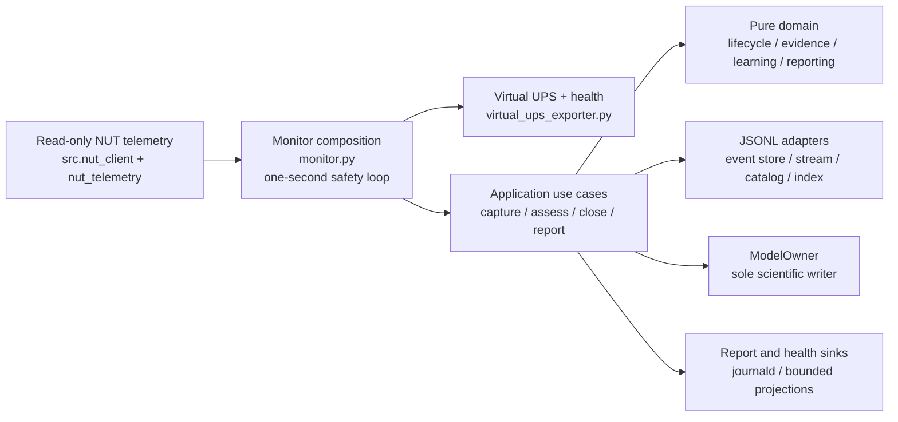

# ADR 0003: Domain JSONL and Automatic Blackout Learning

**Status:** Accepted, 2026-08-16

## Context

ADR 0002 introduced a durable global discharge journal. It fixed the immediate RAM-loss problem
and established an important rule: a partial outage is censored evidence, not a complete battery
measurement. The next design needs stronger event isolation, deterministic crash recovery, and a
safe way to use independent evidence from ordinary blackouts without asking an operator to handle
data.

The UPS exposes voltage, load percentage, status flags, and limited decimal precision. It does not
expose battery current or temperature. A natural partial outage therefore cannot identify absolute
capacity, State of Health (SoH), Peukert exponent, or a replacement voltage-to-SoC curve.

## Decision

### Evidence and logging

Each blackout whose boundary is accepted by the writer has its own append-only JSONL event file under
`~/.config/ups-battery-monitor/events/`. This is the authoritative scientific evidence. Records are
hash-linked, synchronised, bounded, and closed with one terminal outcome. Reboot gaps, missing
samples, corruption, and capture damage stay explicit; they are never silently interpolated.

Storage-unavailable startup has a finite, explicit boundary. The application retains at most eight
separately identifiable pre-start blackout boundaries in memory. Repeated OB polls in one open
physical episode coalesce, and an OL poll closes that retained episode. Beyond that bound, the
application does not invent per-event JSONL files: it keeps one aggregate
`prestart_boundary_overflow` rejection with the exact count and first/last boot and monotonic
provenance, and exposes degraded health immediately. On recovery, that aggregate is appended as a
system gap to the next retained event. It is an explicit bounded-loss receipt, not individual
scientific evidence for the overflowed boundaries. A hard process or host loss before any writer
command becomes durable remains an unavoidable RAM-only loss.

`index.jsonl` is a rebuildable bounded projection. `active.json` is a bounded work registry. Neither
replaces the event files as evidence. We will not add SQLite or another database.

Journald remains the human and operational event log. It may explain an outcome, but it is not an
estimator input and cannot reconstruct missing scientific evidence.

This supersedes ADR 0002's **runtime global-journal choice**. ADR 0002 remains unchanged as the
historical record of Release A. Its `discharge-events-v1.jsonl` file remains byte-for-byte unchanged
as a read-only archive. New runtime code neither opens nor imports it, including during rollback or
re-upgrade.

### Automatic processing and domain boundary

The daemon performs the complete path continuously and unattended:

```text
capture -> assess -> compare -> identify -> decide -> report
```

No operator, external agent, Grafana service, or manual data preparation is part of that path.
Business decisions are pure, frozen domain values and policies. Application services orchestrate
use cases. Adapters own NUT, JSONL, filesystem, clock, and model persistence.

### Current architecture map

The following diagram is normative for the current candidate. Files under `docs/plans/` and
`docs/reviews/` are preserved planning/review snapshots; their historical module counts and
intermediate dependency maps are not the current architecture.



Text fallback: read-only NUT telemetry enters `monitor.py`; safety is published before asynchronous
application work. Application services use pure domain decisions, the JSONL facade, and the sole
`ModelOwner` commit lane. No application or NUT path sends UPS commands.

The monitor polls physical NUT data every second. It calculates and publishes the physical and
virtual safety result before offering an immutable observation to asynchronous persistence. The
publication freshness bound is the derived telemetry-loss grace (30 seconds by default); after a
telemetry read failure exceeds that bound, the exporter writes an explicit `OB DISCHRG LB`/zero-
runtime fail-safe and stops refreshing the watchdog. A failure while publishing the safety file
invalidates the old output immediately and is fatal to this safety loop; an old `OL` file is never
trusted. On a cold start with no proven
physical observation, the exporter does not invent `LB`: it remains unavailable during the finite
grace and then fails closed without creating synthetic safety output. Storage failure may reject
science, but it must not delay or weaken shutdown protection.

The accepted derived-telemetry policy uses a default 30-second grace for a routine `upsd`/NUT
restart before treating the derived safety state as unavailable. With the default five-minute modeled
threshold and two-minute hard floor, the grace is 30 seconds and its upper bound is `5m - 2m = 3m`;
an unusually large transport budget therefore cannot consume the hard-floor reserve. This is a
bounded policy margin, not fresh physical evidence, and it avoids turning a routine telemetry-
server restart into a false shutdown.
Available sensors cannot distinguish a simultaneous real blackout from simultaneous NUT loss; no
software grace resolves that ambiguity, so it remains an explicit acceptance and live-UAT risk.

The current production boundary is intentionally explicit:

- `src/monitor.py` is the composition root and `MonitorDaemon` owns the one-second poll order;
  `src/monitor_config.py` fixes the one-second interval and defaults NUT to `localhost:3493` with a
  two-second socket timeout.
- `src/nut_client.py` (`NUTClient`, `NUTTelemetryPort`) reads NUT; `src/adapters/nut_telemetry.py`
  (`NutTelemetry`) converts one reply into a physical `PhysicalObservation` and implements the
  `PhysicalTelemetryPort` contract. `src/application/safety.py` calculates safety from one frozen
  model snapshot; `src/virtual_ups_exporter.py` atomically publishes the virtual UPS and health.
- Application orchestration is in `src/application/capture_blackout.py`, `capture_writer.py`,
  `background_coordinator.py`, `assessment_worker.py`, `close_blackout.py`, and
  `reporting_scheduler.py`. The least-authority storage ports are
  `CaptureEventStorePort`, `AssessmentQueryEventStorePort`, `AssessmentCloseEventStorePort`,
  `StartupRecoveryEventStorePort`, `ReportingEventStorePort`, `MaintenanceEventStorePort`, and
  `ReportingMaintenanceEventStorePort` in `src/application/ports.py`; `PhysicalTelemetryPort`,
  `ReportSinkPort`, and `HealthAlertPort` are defined there as well. Model access is split into
  `ModelSnapshotPort`, `ModelPolicyPort`, `ModelPreparationPort`, `AssessmentModelPort`, and
  `ModelCommitPort` in `src/application/model_port.py`.
- Pure business rules live in `src/domain/` (lifecycle, readiness, evidence, comparison, IR
  identification, learning, decline, reporting, and values). `src/adapters/jsonl_event_store.py`
  is the transactional JSONL facade; `src/adapters/model_owner.py` (`ModelOwner`) is the sole
  scientific model writer. `BackgroundDependencies` in `background_coordinator.py` receives the
  narrow assessment, startup, reporting, commit, and policy capabilities separately; it is
  composition data, not a new persistence authority.

Scientific storage is safety-first at startup. The daemon initially uses a deferred store and can
continue publishing safety with capture/learning degraded when the event directory is unavailable;
the background coordinator retries recovery after the first safety publication. A second writer
holding `~/.config/ups-battery-monitor/monitor.lock` raises a fatal storage conflict after that
publication; it is not silently downgraded or retried as ordinary capture degradation.

### Virtual UPS lifecycle and installation boundary

The virtual NUT driver is a projection of the monitor, not an independent source. The candidate
exact-instance unit `nut-driver@cyberpower-virtual.service` is ordered after and bound to
`ups-battery-monitor.service`, while the monitor service unlinks
`/run/ups-battery-monitor/ups-virtual.dev` before start and after stop. On the automatic lifecycle
path, monitor readiness follows a new physical observation and atomic publication; only then can
the ordered driver pass its regular-file wait. Mere file existence outside that lifecycle is not
proof of freshness. Fatal monitor starts are limited to three attempts in five minutes with a
ten-second delay; transient NUT telemetry loss is retried inside the running process. These are
candidate guarantees, not a claim that the exact unit is already deployed.

A planned maintenance stop is intentionally not transparent: the monitor stops publishing and the
virtual UPS becomes unavailable and unmonitored. Maintenance therefore requires stable physical
power, an available operator/control path, and an explicit check that no outage or UPS test is in
progress. After maintenance, start the monitor-owned exact instance through the normal dependency
path and require a new physical observation and publication before treating host protection as
healthy.

The isolated external NUT fixture (observed NUT 2.8.1; the test contract accepts NUT 2.8 and newer)
made the reason for this lifecycle concrete: unlinking `.dev` while `dummy-ups` is still running
leaves its previous `OL` in memory, whereas stopping the driver makes `upsc` unavailable. A cold
driver start without `.dev` is unavailable, and a fresh file followed by a driver restart returns
`OL`. This is an isolated fixture result, not live UPS acceptance or deployment evidence.

The installer renders the service and driver units and runs `systemd-analyze verify` before the
first production mutation. It snapshots the monitor unit, exact virtual-driver fragment, legacy
drop-in, both wants-link states, NUT/upsmon files, and the pre-install active/enabled state. A later
failure restores those bytes and states, restarting only units
that were active before the transaction in dependency order; inactive units remain inactive. A
partial restart failure is reported as an incomplete rollback. Temporary transaction backups are
removed after the transaction; the operator-managed pre-transform model backup and all JSONL/
Release A evidence remain subject to the runbook retention rules.

One `ModelOwner` is the only mutable model writer. Each safety poll uses one immutable snapshot, and
the first on-battery observation freezes that same snapshot for the event.

### What a natural blackout may teach

A grid-restored blackout is partial and censored. It may compare observed voltage/runtime behaviour
only inside the trusted observed interval. It never becomes measured total runtime, capacity, SoH,
Peukert, or LUT evidence.

Natural learning is limited to the load-sag coefficient `ir_k`, and only when an independent load
step supplies stable before/transition/after voltage and load evidence. Strict coverage, timing,
movement, quantisation, cohort, epoch, revision, and anti-feedback gates apply. Eligible evidence
from several natural events may reduce `ir_k`; an update can never increase it or make future
shutdown later. Capacity, SoH, Peukert, and LUT values are never learned by this path.

A vendor self-test is operational evidence only. It can test detection, CAL classification,
durability, and reporting, but it never authorizes natural comparison or learning.

Physical firmware `LB` is retained as a diagnostic fact and possible reserve proxy. It does not
directly set virtual `LB`, request FSD, or change shutdown policy. The modeled runtime thresholds
remain authoritative. There is no temperature correction because this UPS has no temperature
sensor.

The candidate deliberately handles an otherwise unclassified physical status more conservatively
than Release A: it evaluates that poll as a real blackout instead of retaining a stale prior class.
Current modeled reserve still controls virtual `LB`, so a healthy `COMMFAULT` poll does not request
shutdown while low or unavailable modeled reserve fails closed. This is a pre-registered safety
difference. An unfinished capture in `active.json` is not evidence that virtual `LB` was published;
after restart the latch begins clear and the first current poll recomputes safety. In particular,
a first post-restart physical `OL` publishes virtual `OL` and closes recovered capture work
asynchronously. Event-scoped sticky `LB` applies only after the current process actually publishes
`LB`; it lasts at most five seconds while durable recovery is pending. If recovery is still not
safe at that deadline, the next fresh physical `OL` is published, capture and learning are marked
unhealthy, and the safety process requests a controlled restart. The registry does not currently
persist publication evidence across a process restart.

### Reporting and decline

Every event ends with a durable, plain-language outcome, including exact refusal reasons when the
model does not change. Short events may correctly report `comparison_not_attempted`.

Possible decline is reported from comparable sealed raw evidence, recomputed under the current
evaluator. It is a trend signal, not a causal diagnosis or SoH measurement. Upward load sag is
stored and reported but never applied to the safety model.

### Release quality gates

The release candidate is accepted only with the repository gates: per-function CRAP score at most
30; every production module at most 800 physical source lines and every class at most 500; Ruff
structural-complexity and suppression checks; `lint-imports`; `tach check` and `tach check --exact`;
type, dead-code, formatting, and test checks. The executable aggregate is `just check`; its CRAP
checks are `pytest --cov=src --crap --crap-threshold=30` plus
`scripts/check_crap.py --threshold 30`. These static gates establish release hygiene only; they do
not prove a live UPS acceptance or deployment.

## Consequences

- Ordinary outages provide useful history automatically, even when they cannot authorize science.
- Crash, reboot, gap, queue loss, and corruption are explicit and fail scientific use closed.
- A storage outage can exceed the bounded pre-start FIFO. The resulting aggregate rejection count
  and first/last provenance are durable when a retained event can be recovered; no unbounded
  in-memory queue or second evidence journal is introduced.
- A first sample retained only in RAM cannot survive a hard process/host kill before the writer can create
  durable bytes. Graceful stop performs a bounded final lifecycle submission; an unwritable store remains
  explicit in health. A second synchronous evidence journal is deliberately not introduced.
- Safety publication stays independent from slower persistence and assessment work.
- The conservative learning direction is deliberately asymmetric; some valid physical estimates
  will be reported but not applied.
- Rare natural load steps may mean the model never changes. That is a physical limitation, not an
  operator task.
- Historical Release A evidence remains available for forensics, but it is outside the new runtime
  evidence graph.
- This ADR records the accepted architecture. It does not claim that the candidate has passed live
  UPS acceptance or has been deployed.

## Rejected alternatives

- **Keep one growing global journal:** weaker event isolation and more complex bounded recovery.
- **Use journald or Grafana as evidence:** neither provides the required durable canonical record.
- **Use SQLite:** unnecessary for rare bounded events and adds a second persistence model.
- **Learn capacity, SoH, Peukert, or LUT from partial outages:** the available sensors cannot
  identify those quantities.
- **Let raw firmware LB control shutdown:** this is not yet supported by independent evidence on
  this UPS.
- **Use automatic self-tests to create learning evidence:** test discharge is not a natural
  blackout and would create a feedback path.
